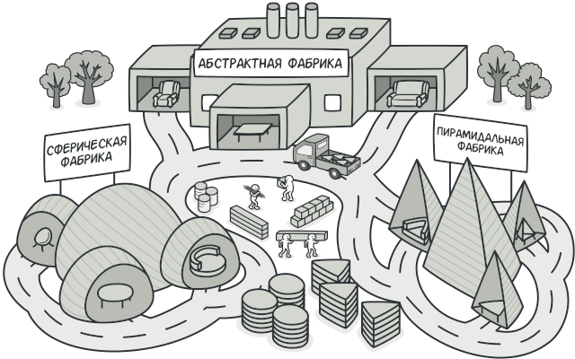
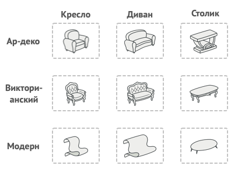
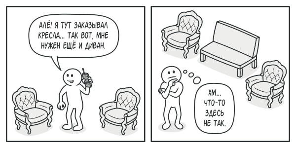
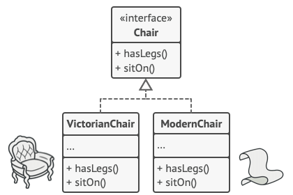
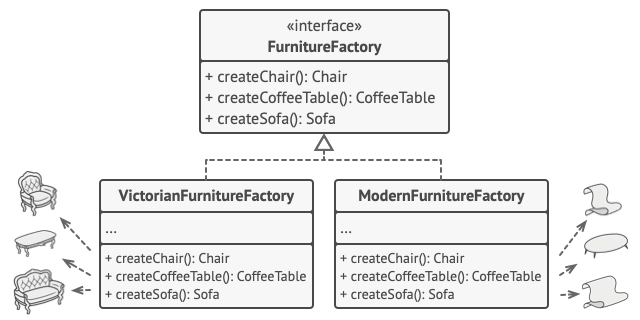

# Абстрактная фабрика

**Абстрактная фабрика** — это порождающий паттерн проектирования, который позволяет создавать семейства связанных объектов, не привязываясь к конкретным классам создаваемых объектов.

## Проблема

Представьте, что вы пишете симулятор мебельного магазина. Ваш код содержит:

Семейство зависимых продуктов. Скажем, Кресло + Диван + Столик.

Несколько вариаций этого семейства. Например, продукты Кресло, Диван и Столик представлены в трёх разных стилях: Ар-деко, Викторианском и Модерне.

Вам нужен такой способ создавать объекты продуктов, чтобы они сочетались с другими продуктами того же семейства. Это важно, так как клиенты расстраиваются, если получают несочетающуюся мебель.

Кроме того, вы не хотите вносить изменения в существующий код при добавлении новых продуктов или семейcтв в программу. Поставщики часто обновляют свои каталоги, и вы бы не хотели менять уже написанный код каждый раз при получении новых моделей мебели.

## Решение

Для начала паттерн Абстрактная фабрика предлагает выделить общие интерфейсы для отдельных продуктов, составляющих семейства. Так, все вариации кресел получат общий интерфейс Кресло, все диваны реализуют интерфейс Диван и так далее.

Далее вы создаёте абстрактную фабрику — общий интерфейс, который содержит методы создания всех продуктов семейства (например, создатьКресло, создатьДиван и создатьСтолик). Эти операции должны возвращать абстрактные типы продуктов, представленные интерфейсами, которые мы выделили ранее — Кресла, Диваны и Столики.

Как насчёт вариаций продуктов? Для каждой вариации семейства продуктов мы должны создать свою собственную фабрику, реализовав абстрактный интерфейс. Фабрики создают продукты одной вариации. Например, ФабрикаМодерн будет возвращать только КреслаМодерн,ДиваныМодерн и СтоликиМодерн.

Клиентский код должен работать как с фабриками, так и с продуктами только через их общие интерфейсы. Это позволит подавать в ваши классы любой тип фабрики и производить любые продукты, ничего не ломая.

Например, клиентский код просит фабрику сделать стул. Он не знает, какого типа была эта фабрика. Он не знает, получит викторианский или модерновый стул. Для него важно, чтобы на стуле можно было сидеть и чтобы этот стул отлично смотрелся с диваном той же фабрики.

Осталось прояснить последний момент: кто создаёт объекты конкретных фабрик, если клиентский код работает только с интерфейсами фабрик? Обычно программа создаёт конкретный объект фабрики при запуске, причём тип фабрики выбирается, исходя из параметров окружения или конфигурации.