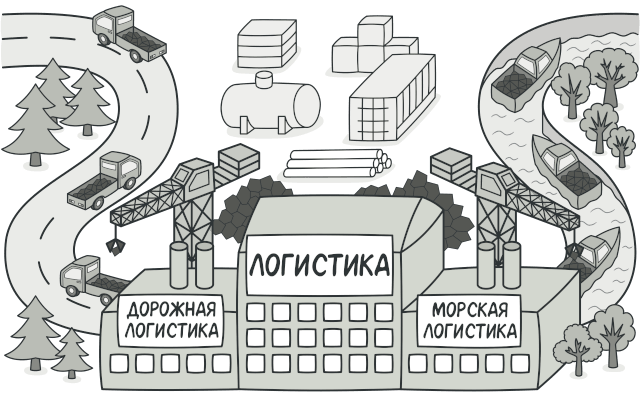
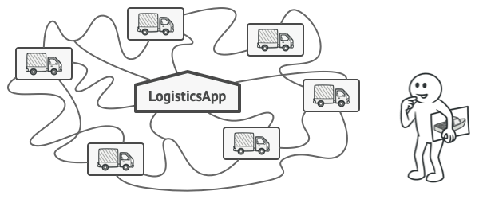
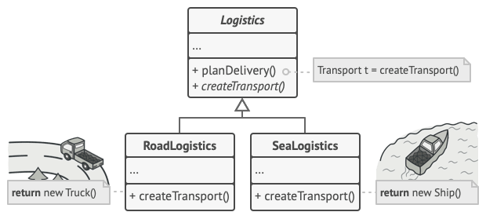
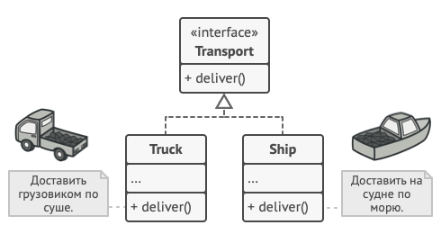
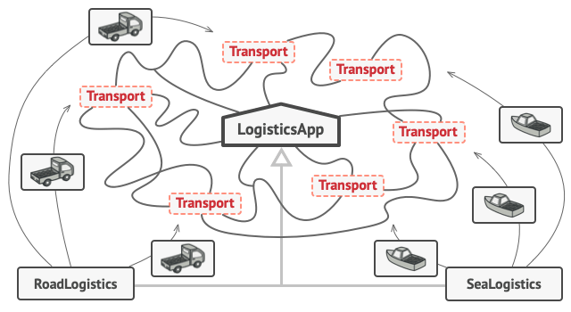

# Фабричный метод

**Фабричный метод** — это порождающий паттерн проектирования, который определяет общий интерфейс для создания объектов в суперклассе, позволяя подклассам изменять тип создаваемых объектов.

## Проблема

Представьте, что вы создаёте программу управления грузовыми перевозками. Сперва вы рассчитываете перевозить товары только на автомобилях. Поэтому весь ваш код работает с объектами класса Грузовик.

В какой-то момент ваша программа становится настолько известной, что морские перевозчики выстраиваются в очередь и просят добавить поддержку морской логистики в программу.

Добавить новый класс не так-то просто, если весь код уже завязан на конкретные классы.

Отличные новости, правда?! Но как насчёт кода? Большая часть существующего кода жёстко привязана к классам Грузовиков. Чтобы добавить в программу классы морских Судов, понадобится перелопатить всю программу. Более того, если вы потом решите добавить в программу ещё один вид транспорта, то всю эту работу придётся повторить.

В итоге вы получите ужасающий код, наполненный условными операторами, которые выполняют то или иное действие, в зависимости от класса транспорта.

## Решение
Паттерн Фабричный метод предлагает создавать объекты не напрямую, используя оператор new, а через вызов особого фабричного метода. Не пугайтесь, объекты всё равно будут создаваться при помощи new, но делать это будет фабричный метод.

Подклассы могут изменять класс создаваемых объектов.

На первый взгляд, это может показаться бессмысленным: мы просто переместили вызов конструктора из одного конца программы в другой. Но теперь вы сможете переопределить фабричный метод в подклассе, чтобы изменить тип создаваемого продукта.

Чтобы эта система заработала, все возвращаемые объекты должны иметь общий интерфейс. Подклассы смогут производить объекты различных классов, следующих одному и тому же интерфейсу.

Все объекты-продукты должны иметь общий интерфейс.

Например, классы Грузовик и Судно реализуют интерфейс Транспорт с методом доставить. Каждый из этих классов реализует метод по-своему: грузовики везут грузы по земле, а суда — по морю. Фабричный метод в классе ДорожнойЛогистики вернёт объект-грузовик, а класс МорскойЛогистики — объект-судно.

Пока все продукты реализуют общий интерфейс, их объекты можно взаимозаменять в клиентском коде.

Для клиента фабричного метода нет разницы между этими объектами, так как он будет трактовать их как некий абстрактный Транспорт. Для него будет важно, чтобы объект имел метод доставить, а как конкретно он работает — не важно.