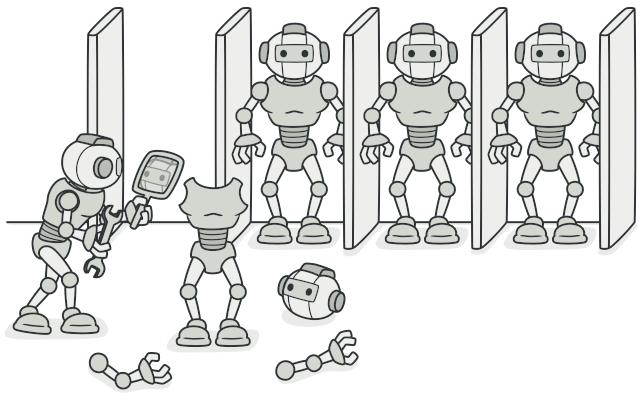
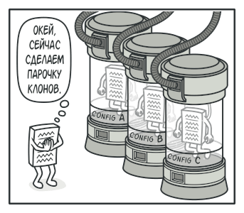

# Прототип

**Прототип** — это порождающий паттерн проектирования, который позволяет копировать объекты, не вдаваясь в подробности их реализации.

 ## Проблема
У вас есть объект, который нужно скопировать. Как это сделать? Нужно создать пустой объект такого же класса, а затем поочерёдно скопировать значения всех полей из старого объекта в новый.

Прекрасно! Но есть нюанс. Не каждый объект удастся скопировать таким образом, ведь часть его состояния может быть приватной, а значит — недоступной для остального кода программы.

Но есть и другая проблема. Копирующий код станет зависим от классов копируемых объектов. Ведь, чтобы перебрать все поля объекта, нужно привязаться к его классу. Из-за этого вы не сможете копировать объекты, зная только их интерфейсы, а не конкретные классы.

 ## Решение
Паттерн Прототип поручает создание копий самим копируемым объектам. Он вводит общий интерфейс для всех объектов, поддерживающих клонирование. Это позволяет копировать объекты, не привязываясь к их конкретным классам. Обычно такой интерфейс имеет всего один метод clone.

Реализация этого метода в разных классах очень схожа. Метод создаёт новый объект текущего класса и копирует в него значения всех полей собственного объекта. Так получится скопировать даже приватные поля, так как большинство языков программирования разрешает доступ к приватным полям любого объекта текущего класса.

Объект, который копируют, называется прототипом (откуда и название паттерна). Когда объекты программы содержат сотни полей и тысячи возможных конфигураций, прототипы могут служить своеобразной альтернативой созданию подклассов.

Предварительно заготовленные прототипы могут стать заменой подклассам.

В этом случае все возможные прототипы заготавливаются и настраиваются на этапе инициализации программы. Потом, когда программе нужен новый объект, она создаёт копию из приготовленного прототипа.